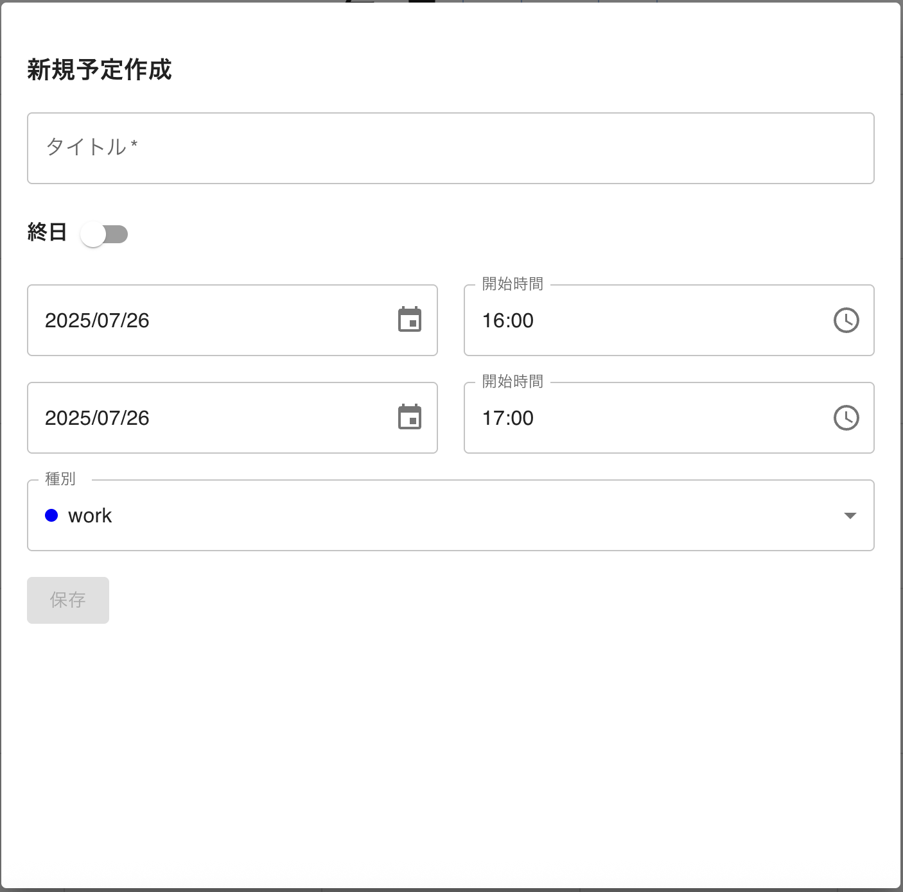

# 演習問題の提出

提出者名：（記載をお願いします）

## Phase1: フロントエンド演習問題の提出

### 問題 1. 分類ラベルの追加

### 問題 2. ヘッダーの UI 調整

### 問題 3. レスポンシブ対応

<video src="問題3_レスポンシブ対応.mov" controls="true" autoplay muted></video>

### 問題 4. 予定追加の UI/UX 改善

### 問題 5. 予定表示のバグ修正

### 問題 6. 予定削除機能の追加

## Phase2. 統合演習問題

## Phase 3: 改善・最適化
